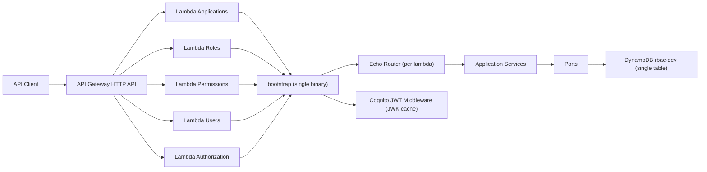

# RBAC Service (Go + Hexagonal + Serverless)

Servicio RBAC en Go con arquitectura hexagonal, Echo, AWS Lambda (5 funciones), API Gateway HTTP API, DynamoDB single-table, validación JWT Cognito, X-Ray y TDD con Testify.

## Arquitectura Hexagonal

### Capas
- `internal/domain`: entidades y errores de dominio.
- `internal/ports`: contratos (interfaces) de repositorios.
- `internal/application`: casos de uso/servicios (lógica de negocio).
- `internal/infrastructure`: implementaciones técnicas (DynamoDB, Cognito JWT).
- `internal/interfaces/http`: handlers y routers Echo por dominio.
- `cmd/bootstrap`: composición de dependencias + selección de Lambda por `LAMBDA_HANDLER`.

### Principios aplicados
- Sin lógica de negocio en handlers.
- Dominio desacoplado de infraestructura.
- Un solo binario `bootstrap` reutilizado por 5 funciones Lambda.
- Sin variables globales.

## Diagrama de interacción



## Lambdas y rutas

- Applications Lambda
  - `POST /applications`
  - `PUT /applications/{id}`
  - `GET /applications/{id}`
- Roles Lambda
  - `POST /applications/{app_id}/roles`
  - `PUT /applications/{app_id}/roles/{role_id}`
  - `GET /applications/{app_id}/roles`
- Permissions Lambda
  - `POST /applications/{app_id}/permissions`
  - `GET /applications/{app_id}/permissions`
- Users Lambda
  - `POST /applications/{app_id}/users/{user_id}/roles`
  - `GET /applications/{app_id}/users/{user_id}`
- Authorization Lambda
  - `POST /authorize`

## DynamoDB Single-Table Design

Tabla: `rbac-dev` (real: `rbac-${stage}`)

- Application
  - `PK = APP#<app_id>`
  - `SK = META`
- Role
  - `PK = APP#<app_id>`
  - `SK = ROLE#<role_id>`
  - `permissions: []string`
- Permission
  - `PK = APP#<app_id>`
  - `SK = PERM#<permission_id>`
- UserAppRoles
  - `PK = USER#<user_id>`
  - `SK = APP#<app_id>`
  - `roles: []string`

## Variables necesarias

```bash
export AWS_REGION=us-east-1
export COGNITO_USER_POOL_ID=<your_user_pool_id>
export AUTH_MODE=api_key
export INTERNAL_API_TOKEN=<optional>
```

## Build y Deploy

```bash
make build
sls deploy --stage dev
```

## Tests

```bash
make test
```

## MVP Authentication Mode

Este MVP usa API Key en API Gateway.

### Obtener API Key

En AWS Console: API Gateway -> API Keys -> `rbac-dev-key`.

### Usar API Key

Incluye el header `x-api-key` en cada request:

```bash
curl -X GET "$API_URL/applications/app-1" \
  -H "x-api-key: <your-key>" \
  -H "Authorization: Bearer <jwt>"
```

### Modos de autenticacion

`AUTH_MODE` define el comportamiento del middleware:

- `none`: no valida nada.
- `api_key`: no valida en Lambda, API Gateway valida el `x-api-key`.
- `cognito`: usa el validador JWT de Cognito.

### To enable Cognito

1. Set `AUTH_MODE=cognito`.
2. Configure `httpApi` authorizer in `serverless.yml`.
3. Provide `COGNITO_USER_POOL_ID`.

## Ejemplo de request de autorización

```bash
curl -X POST "$API_URL/authorize" \
  -H "Authorization: Bearer <jwt>" \
  -H "Content-Type: application/json" \
  -d '{
    "app_id": "app-1",
    "permission": "perm:read"
  }'
```

Respuesta esperada:

```json
{"allowed": true}
```

## X-Ray

`serverless.yml` habilita:

```yaml
provider:
  tracing:
    lambda: true
    apiGateway: true
```

Además el cliente DynamoDB se instrumenta con `aws-xray-sdk-go`.
